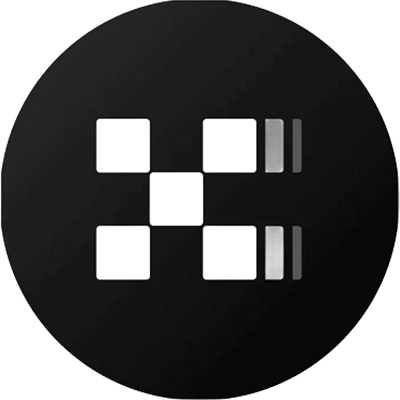

# Santiago Galvan

**Backend Engineer | Blockchain Infrastructure**  
Buenos Aires, Argentina

I'm a backend engineer with **5+ years of experience** building backend systems, internal tools,
release pipelines, smart contracts, and production infrastructure.

Currently, I'm co-founder and founding backend engineer at
**[Caravana Studio](https://github.com/caravana-studio)**, where I build backend infrastructure for
**[Jokers of Neon](https://jokersofneon.com/)**, a production onchain card game live since December 2025
with **150k+ Starknet mainnet transactions** and approximately **250 monthly active users**.

I'm looking for backend or blockchain infrastructure roles where I can combine production engineering,
smart contracts, and product-minded execution.

## What I Bring

- **Backend infrastructure** across APIs, workers, services, monitoring, integrations, and payment-related flows.
- **Production web3 experience** connecting backend systems with Starknet smart contracts and onchain game logic.
- **Platform engineering background** from internal tooling and release pipelines for Mercado Libre and Mercado Pago mobile apps.
- **Smart contract development** with Cairo, Starknet, Solidity, Foundry, and blockchain-specific testing workflows.
- **Open-source and ecosystem work**, including 30+ pull requests across Starknet projects, backend tooling, and developer infrastructure.
- **Product ownership** from co-founding a studio, shipping features, supporting monetization, and translating user needs into technical work.

## Core Stack

  
  
  
  
  
  
  
  
  

**Backend:** TypeScript, Node.js, Java, Spring Boot, REST APIs, Workers, PostgreSQL, Supabase  
**Blockchain:** Cairo, Starknet, Dojo, Solidity, Foundry, OpenZeppelin, Aztec, Cartridge SDK  
**Infrastructure:** GitHub, Jenkins, Datadog, Kibana, Firebase, RevenueCat, Appsflyer, Vercel, Render  
**Frontend / Product:** React, Three.js, technical demos, gameplay-oriented UX, product prototyping

## Experience Snapshot

| Role | What I Worked On | Stack |
| --- | --- | --- |
| **Founding Backend Engineer / Co-founder** at [Caravana Studio](https://github.com/caravana-studio) | Backend infrastructure for Jokers of Neon, including APIs, workers, monitoring, payment-related flows, integrations, Cairo contracts, and onchain game logic. | TypeScript, Node.js, Cairo, Starknet, Cartridge SDK, RevenueCat, Firebase, Appsflyer, Supabase, PostgreSQL, Datadog |
| **Smart Contract Developer** at Lambda Class | Foundational Cairo 1 libraries, Solidity-to-Cairo migration work for Uniswap V2, Starknet testnet deployment workflows, and smart contract testing. | Cairo 1, Solidity, Starknet, Foundry |
| **Software Engineer Analyst** at Mercado Libre | Java/Spring Boot internal services for Mercado Libre and Mercado Pago mobile release pipelines, workflow automation, production monitoring, and incident support. | Java, Spring Boot, Jenkins, GitHub, Datadog, Kibana |
| **Open Source Contributor** in the Starknet ecosystem | 30+ PRs across 10+ projects, contributing fixes, features, tests, and developer tooling improvements. | Cairo, Solidity, Rust, Starknet, TypeScript |

## Featured Work

| Project | Focus | Stack | Links |
| --- | --- | --- | --- |
| **Jokers of Neon** | Production onchain card game with 150k+ Starknet mainnet transactions | TypeScript, Node.js, Cairo, Starknet, PostgreSQL | [Website](https://jokersofneon.com/) |
| **StarkBound** | 1st place at Dojo Game Jam #8 | Cairo, Dojo, TypeScript, React | [Repo](https://github.com/dubzn/starkbound) · [Demo](https://youtu.be/naOFyJ5kLfE) |
| **Mental Poker** | 1st place at RE{DEFINE} Hackathon, ZK card-game mechanics | Cairo, Noir, Garaga, TypeScript | [Repo](https://github.com/dpinones/mental-poker) · [Winners](https://dorahacks.io/hackathon/redefine/winner) |
| **Liar's Proof** | 1st place at Zypherpunk Hackathon | Cairo, Dojo, Noir, Garaga, TypeScript | [Repo](https://github.com/dubzn/liars-proof) · [Devfolio](https://devfolio.co/projects/liars-proof-a7e2) · [Demo](https://youtu.be/4DsNVXjBLjk) |
| **X402 Operator** | Payment/operator prototype for X Layer Arena | Solidity, TypeScript, React | [Repo](https://github.com/dubzn/operator-xlayer) · [Demo](https://youtu.be/GwgDGpqz3h8) |
| **Phantom Chase** | ZK gaming prototype for Stellar Hacks | Noir, TypeScript, React, Three.js | [Repo](https://github.com/dubzn/phantom-chase) · [DoraHacks](https://dorahacks.io/buidl/39828) |
| **Treasure Hunt** | Aztec research project | Noir, TypeScript, React | [Repo](https://github.com/caravana-studio/aztec-treasure-hunt) · [Post](https://x.com/twitter/status/2014738217967169781) |

## Hackathons & Events

Since 2022 I've participated in **20+ international hackathons and ecosystem events**, including
in-person events in France, Mexico, Turkey, and Argentina. I've earned **10+ awards, finalist
placements, or podium finishes** across Starknet, Dojo, ZK gaming, and onchain application projects.

### 2026

- ** Build X Hackathon | X Layer Arena** *(April)* - [X402 Operator](https://github.com/dubzn/operator-xlayer) -   
- ** 1st place, Dojo Game Jam #8** *(March)* - [StarkBound](https://github.com/dubzn/starkbound) - [Luma](https://luma.com/w1wxpfv3?tk=EShCKG) -    
- ** 1st place, RE{DEFINE} Hackathon | Starknet** *(February)* - [Mental Poker](https://github.com/dpinones/mental-poker) - [DoraHacks](https://dorahacks.io/hackathon/redefine/winner) -    
- ** Stellar Hacks: ZK Gaming** *(February)* - [Phantom Chase](https://github.com/dubzn/phantom-chase) - [DoraHacks](https://dorahacks.io/buidl/39828) -    
- ** Monad Moltiverse Hackathon** *(February)* - [Fluffy Fate](https://github.com/dpinones/buckshot-roulette) -   
- ** Research project** *(January)* - [Treasure Hunt](https://github.com/caravana-studio/aztec-treasure-hunt) - [Post](https://x.com/twitter/status/2014738217967169781) -   

### 2025

- ** 1st place, Zypherpunk Hackathon** *(December)* - [Liar's Proof](https://github.com/dubzn/liars-proof) - [Devfolio](https://devfolio.co/projects/liars-proof-a7e2) -     
- **  Starknet Startup House** *(Argentina)*
- ** 3rd place, Dojo Game Jam #7** *(October)* - [Tomie Games](https://github.com/dubzn/tomie-games)
- ** Starknet Grinta Sprint** *(August)* - [Starky](https://github.com/dubzn/starky)
- **  Starknet Startup House** *(France, July)*
- ** 1st place, Starknet Winter Hackathon 2025** *(January)* - [Jokers of Neon Mods](https://github.com/caravana-studio/jokers-of-neon-mods)

### 2024

- ** 1st place, Dojo Spooky Game Jam** *(November)* - [JON x Loot Survivor Mod](https://github.com/caravana-studio/jokers-ls-mod-contracts)
- ** 3rd place, Starknet Winter Hackathon** *(February)* - [Verdania](https://github.com/amegakure-studio/verdania-cairo)
- **  2nd place, ETH 5 de Mayo Hackathon** *(Mexico, February)* - [Paymeez](https://github.com/dbejarano820/eth-cdm-hackathon)

### 2023

- ** 2nd place, Dojo Game Jam #3** *(December)* - [Starkane](https://x.com/0xstarkane)
- **  Finalist, Starknet Hacker House** *(Istanbul, November)* - VAUTT Protocol
- ** Dojo Game Jam #1** *(October)* - [Wordle](https://github.com/dpinones/wordle-dojo)
- ** Pragma Hackathon #1** *(June)* - [MechaStark](https://github.com/MechaStark-RPG/mecha-stark-contract)

### 2022

- ** 1st place, Gaming MatchBoxDao Hackathon #2** *(October)* - [PathfindersAr](https://github.com/dpinones/pathfinders-ar)

## Demos & Media

I also care about how technical work is presented. These are some demos, trailers, and presentations I've made or helped prepare:

<table>
  <tr>
    <td width="50%" valign="top">
      
       
      <strong>X402 Operator</strong>
       
      Payment/operator prototype demo
    </td>
    <td width="50%" valign="top">
      
       
      <strong>StarkBound</strong>
       
      Dojo Game Jam #8 winning project
    </td>
  </tr>
  <tr>
    <td width="50%" valign="top">
      
       
      <strong>Liar's Proof</strong>
       
      ZK game demo from Zypherpunk Hackathon
    </td>
    <td width="50%" valign="top">
      
       
      <strong>Tomie Games</strong>
       
      Dojo Game Jam #7 project demo
    </td>
  </tr>
  <tr>
    <td width="50%" valign="top">
      
       
      <strong>Jokers of Neon MOD</strong>
       
      Trailer
    </td>
    <td width="50%" valign="top">
      
       
      <strong>Jokers of Neon</strong>
       
      Short promotion video
    </td>
  </tr>
</table>

## Contact

- Email: [santiagodgalvan@gmail.com](mailto:santiagodgalvan@gmail.com)
- GitHub: [github.com/dubzn](https://github.com/dubzn)
- X: [@dub_zn](https://x.com/dub_zn)
- Studio: [Caravana Studio](https://github.com/caravana-studio)

## Education & Languages

- **Information Systems Degree**, Universidad Nacional de General Sarmiento - 32/34 subjects completed.
- **Technical Degree in Computer Science**, Universidad Nacional de General Sarmiento - completed, final grade average 9/10.
- **Languages:** Spanish native, English advanced.
