## HI!
I'm **Santiago**, a software engineer working as a freelancer since 2022, deeply involved in the **[Starknet](https://www.starknet.io/)**
ecosystem.

Co-founder of **[Caravana Studio](https://github.com/caravana-studio)**, working on **[Jokers of Neon](https://jokersofneon.com/)** as Blockchain Engineer |
**[Cairo](https://www.cairo-lang.org/)** developer, exploring new ways to integrate blockchain into gaming.

I've been building games and tools in the on-chain space, contributing to open-source projects and joining different in-person events and hackathons along the way.

---
## 🏆 Hackathons & Events
### 2026

- **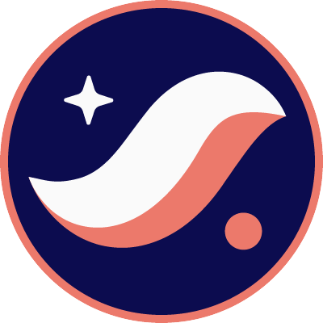 Dojo Game Jam #8** *(March)* – [StarkBound](https://github.com/dubzn/starkbound) - [Luma](https://luma.com/w1wxpfv3?tk=EShCKG) – 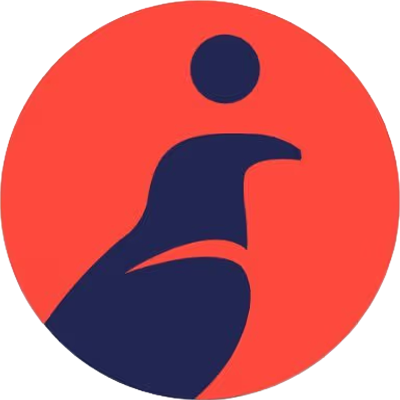 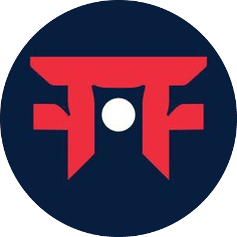 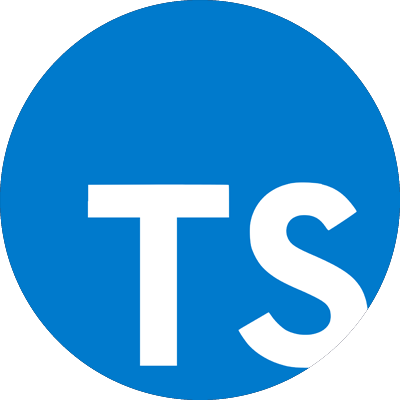 
- ** RE{DEFINE} HACKATHON | Starknet** *(February)* – [Mental Poker](https://github.com/dpinones/mental-poker) - [DoraHacks](https://dorahacks.io/buidl/40188) –  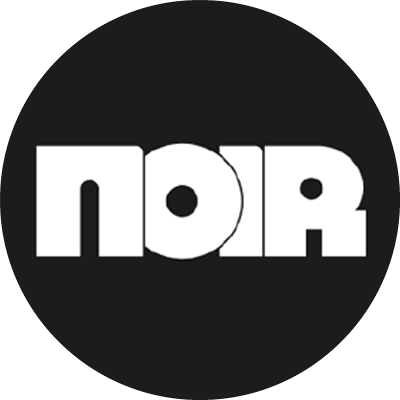 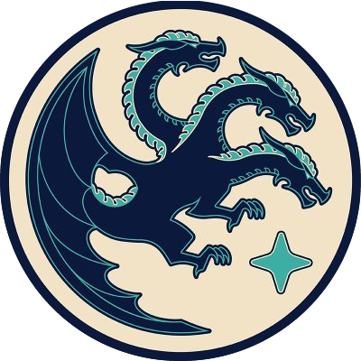 
- ** Stellar Hacks: ZK Gaming** *(February)* – [Phantom Chase](https://github.com/dubzn/phantom-chase) - [DoraHacks](https://dorahacks.io/buidl/39828) –    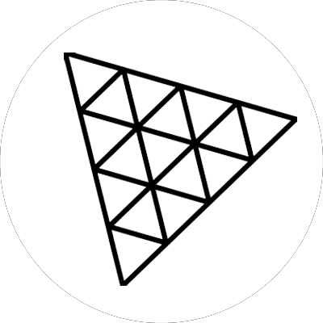
- ** Monad Moltiverse Hackathon** *(February)* – [Fluffy Fate](https://github.com/dpinones/buckshot-roulette) –   
- ** Research project** *(January)* - [Treasure Hunt](https://github.com/caravana-studio/aztec-treasure-hunt) - [X post](https://x.com/twitter/status/2014738217967169781) –   

### 2025
- ** Zypherpunk Hackathon** *(December)* – **[Liar's Proof](https://github.com/dubzn/liars-proof)** – **[Devfolio](https://devfolio.co/projects/liars-proof-a7e2)** –      
- ** 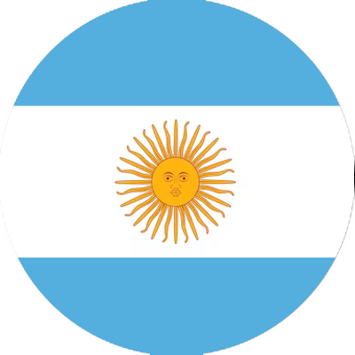 Starknet Startup House (Argentina)**
- ** Dojo Game Jam #7** *(October)* – **[Tomie Games](https://github.com/dubzn/tomie-games)**
- ** Starknet Grinta Sprint** *(August)* – **[Starky](https://github.com/dubzn/starky)**
- **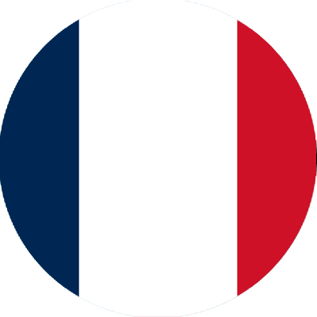 Starknet Startup House (France)** *(July)*
- ** 🥇 Starknet Winter Hackathon 2025** *(January)* – **[Jokers of Neon Mods](https://github.com/caravana-studio/jokers-of-neon-mods)**

### 2024
- ** 🥇 Dojo Spooky Game Jam** *(November)* – **[JON x Loot Survivor Mod](https://github.com/caravana-studio/jokers-ls-mod-contracts)**
- ** 🥉 Starknet Winter Hackathon** *(February)* – **[Verdania](https://github.com/amegakure-studio/verdania-cairo)**
- **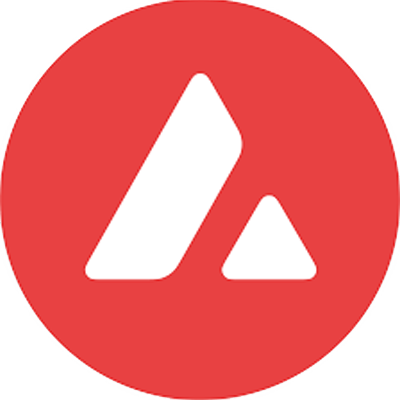 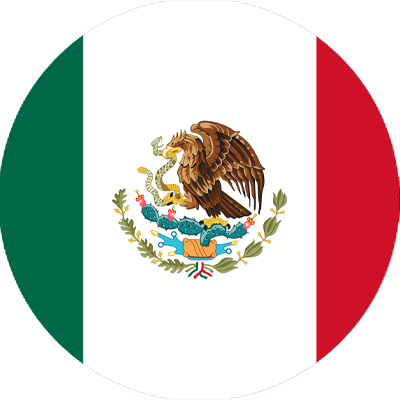 🥈 ETH 5 de Mayo Hackathon (Mexico)** *(February)* – **[Paymeez](https://github.com/dbejarano820/eth-cdm-hackathon)**

### 2023
- ** 🥈 Dojo Game Jam #3** *(December)* – **[Starkane](https://x.com/0xstarkane)**
- **  Finalist Starknet Hacker House (Istanbul)** *(November)* – **VAUTT Protocol**
- ** Dojo Game Jam #1** *(October)* – **[Wordle](https://github.com/dpinones/wordle-dojo)**
- ** 🏆 Pragma Hackathon #1** *(June)* – **[MechaStark](https://github.com/MechaStark-RPG/mecha-stark-contract)**

### 2022
- ** 🥇 Gaming MatchBoxDao Hackathon #2** *(October)* – **[PathfindersAr](https://github.com/dpinones/pathfinders-ar)**

---
## 🎨 Design & Media
I'm interested in design and content creation, so I also learned how to edit images and videos.

Here are some samples of my latest works.

- **[StarkBound | Demo](https://youtu.be/naOFyJ5kLfE)**
- **[Liar's Proof | Demo](https://youtu.be/4DsNVXjBLjk)**
- **[Tomie Games | Demo](https://youtu.be/bah7IStmMq8)**
- **[Jokers of Neon | Presentation](https://youtu.be/BNSUSUuu8_w)**
- **[Jokers of Neon | Promotion](https://youtube.com/shorts/fX49g90ROVE?feature=share)**
- **[Jokers of Neon MOD | Trailer](https://www.youtube.com/watch?v=xtTxSTtLy-k)**

---
## 🔗 Social
<table>
  <tbody>
    <tr>
      <td align="center" valign="top" width="14.28%"><a href="https://x.com/dub_zn"> <b>𝕏 account</b></a> </td>
      <td align="center" valign="top" width="14.28%"> <b>Favorite Pokémon</b></a> </td>
    </tr>
  </tbody>
  <tfoot>
  </tfoot>
</table>

